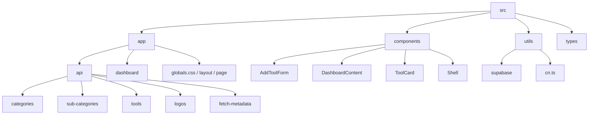

# 🛠️ dev-toolkit

A modern, high-performance developer tool-stash and link directory built to organize, search, and manage web development tools and links efficiently.

---

## ✨ Features

- **🚀 Modern UI/UX:** Built with Tailwind CSS, supporting elegant layouts, interactive search, and category grouping.
- **📂 Categorized Tool Stash:** Easily group developer resources into core categories and detailed sub-categories.
- **🔗 Meta Fetching:** Dynamic API endpoints to fetch websites' metadata and logos seamlessly.
- **⚡ Supercharged Backend:** Fully integrated with Supabase for fast, reliable data persistence and SSR capabilities.
- **⚙️ Developer Dashboard:** Full CRUD capabilities for adding, updating, and removing developer tools/links.

---

## 🎨 Tech Stack

| Technology | Purpose |
| :--- | :--- |
| **Next.js 16 (Turbopack)** | React Framework with App Router & server component routing. |
| **Supabase Client & SSR** | Cloud Database, authentication, and SSR-safe helper utilities. |
| **Tailwind CSS v4** | Next-generation CSS utility framework for rapid styling. |
| **TypeScript** | Strict static type-safety across endpoints and components. |

---

## 🏗️ Directory Structure



---

## 🚀 Getting Started

### 1. Clone the repository

```bash
git clone https://github.com/Cattus9/dev-toolkit.git
cd dev-toolkit
```

### 2. Configure Environment Variables

Create a `.env.local` file in the root directory:

```env
NEXT_PUBLIC_SUPABASE_URL=your-supabase-url
NEXT_PUBLIC_SUPABASE_ANON_KEY=your-supabase-anon-key
```

### 3. Install Dependencies

```bash
npm install
```

### 4. Run Development Server

```bash
npm run dev
```

Open [http://localhost:3000](http://localhost:3000) to view it in the browser.

---

## 🛠️ Scripts

- `npm run dev` - Starts the development server with Turbopack.
- `npm run build` - Creates an optimized production build.
- `npm run start` - Starts the production server.
- `npm run lint` - Runs ESLint to check for code issues.

---

## 🤝 Contributing

Contributions are welcome! Please open an issue or submit a pull request with your suggested changes.
